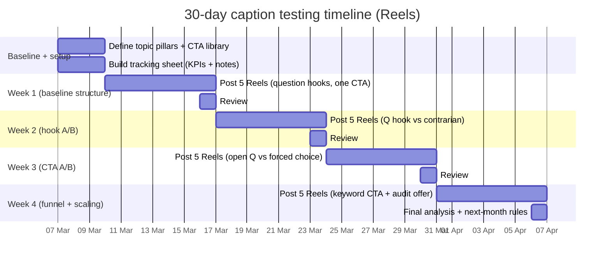

# Knowledge Summary: EliasMaman.md

## Metadata
- source_file: `/Users/maxkiyuna/Library/CloudStorage/GoogleDrive-max.taishi@gmail.com/My Drive/VIBECODE/MyProgramLab/Atomy Marketing/knowledge_base/EliasMaman.md`
- file_type: `md`
- extraction_status: `ok`
- generated_at_utc: `2026-03-07T07:02:56.354691+00:00`

## Extraction Warnings
- none

## Executive Summary (Draft)
- | Reel (IG code) | Date | Hook (original) | Hook (English gloss) | Likes | Comments | Primary source |
|---|---:|---|---|---:|---:|---|
| DHHRlDeybAd | 12 Mar 2025 | “Quais desses filmes você já assistiu?” | “Which of these films have you watched?” | 500K | 22K | citeturn16search12 |
| DOL1o68DmfM | 04 Sep 2025 | “Você conhece alguma criança que joga roblox?” | “Do you know a child who plays Roblox?” | 393K | 12K | citeturn10search13 |
| DQKJIfnDmeQ | 23 Oct 2025 | “Com que idade criança deveria ter celular?” | “At what age should a child have a phone?” | 161K | 3,108 | citeturn10search12 |
| DFtX8CKyxnr | 05 Feb 2025 | “#livros” | “#books” | 105K | 26K | citeturn21search18 |
| DLBBj6WSJ2X | 17 Jun 2025 | “Você pagaria 800 mil em um labubu?” | “Would you pay 800k for a collectible?” | 96K | 4,373 | citeturn0search26 |
| DOY6USwjhwM | 09 Sep 2025 | “Você já viu a série do Alcaraz?” | “Have you seen the Alcaraz series?” | 43K | 1,679 | citeturn9search11 |
| DLDXrAfylWn | 28 Jun 2025 | “Por quem você prefere ser atendido?” | “Who do you prefer to be served by?” | 25K | 241 | citeturn11search28 |
| DDNcxQrp88Z | 05 Dec 2024 | “5 Livros que vão te fazer ser visto e conhecido!” | “5 books that will make you seen/known!” | 10K | 2,591 | citeturn21search3 |
| DLLVY54SVp3 | 21 Jun 2025 | “Você conhece alguém que já caiu nessa?” | “Do you know someone who fell for this?” | 8,831 | 691 | citeturn9search28 |
| DKztqnbMjCh | 12 Jun 2025 | “Quantos livros você já leu em 2025?” | “How many books have you read in 2025?” | 8,174 | 911 | citeturn14search2 |
| DJ2N7G0p3bn | 19 May 2025 | “Você tem saído muito a noite?” | “Have you been going out a lot at night?” | 7,986 | 713 | citeturn14search22 |
| DRnXjf0jiVx | 28 Nov 2025 | “Você conhece alguma mulher que foi enganada…?” | “Do you know a woman who was tricked by this?” | 7,474 | 582 | citeturn11search7 |
| DU3QjEWjsNz | 17 Feb 2026 | “Quem tem audiência dita as regras…” | “Whoever has attention sets the rules…” | 7,268 | 448 | citeturn11search16 |
| DUOtsuiCXA9 | 01 Feb 2026 | “Quantas dessas 5 coisas você já tinha percebido?” | “How many of these 5 things had you noticed?” | 7,174 | 379 | citeturn11search18 |
| DJczEPrOQ2- | 09 May 2025 | “Aceita o desafio de postar 1 reels por dia…?” | “Do you accept the challenge to post daily…?” | 5,041 | 2,070 | citeturn11search21 |
| DLqQnaXSf9Z | 03 Jul 2025 | “Quais desses filmes você já assistiu?” | “Which of these films have you watched?” | 6,657 | 247 | citeturn21search4 |
| DLVpxK5Sci_ | 25 Jun 2025 | “Você aceita o desafio?” | “Do you accept the challenge?” | 4,862 | 1,384 | citeturn0search11 |
| DVPEoM6jhO7 | 26 Feb 2026 | “A nova ostentação não é o que você compra…” | “The new status isn’t what you buy…” | 5,694 | 154 | citeturn6search4turn28search0 |
| DOOcWCzDsWZ | 05 Sep 2025 | “Quando você vai começar a usar essa alavanca…?” | “When will you start using this lever…?” | 3,537 | 1,314 | citeturn9search7 |
| DSFlcrCDs52 | 10 Dec 2025 | “Você teria esse relógio…?” | “Would you own this watch…?” | 4,631 | 140 | citeturn14search17 |

Interpretive note: the two largest outliers (films list; kids + online game) are both “broad audience + list/scene prompt” formats that naturally trigger comments (“Which ones?” / “Yes, my kid does”).
- citeturn16search3turn4search2turn11search16

#### Mermaid flowchart: Elias-style caption structure

```mermaid
flowchart TD
A[Hook: direct question\n(usually 6–12 words)] --> B[Context/Tension:\nwhat's broken, surprising, or unfair]
B --> C[Value:\n1 insight, rule, or contrast\n(no long explanations)]
C --> D[Proof cue (optional):\nnumber, example, cultural reference,\nor "everyone is doing this"]
D --> E[CTA:\nanswer in comments / choose A vs B /\ncomment a keyword / tag someone]
E --> F[Hashtags (optional):\n0–3 niche tags]
```

### Caption length and structure variants

Because full captions are not consistently visible in web previews, lengths are coded by *observable structure* rather than exact word counts.
- | Variant | What it looks like | What it’s good for | Examples in sample |
|---|---|---|---|
| One-line question | Hook = caption | Maximise comment impulse; low friction | “Você aceita o desafio?” citeturn0search11 |
| Question + contrast statement | Hook + “new rule / old rule” framing | Value positioning; identity signalling | “A nova ostentação…” citeturn6search4turn28search0 |
| List prompt | “Which ones?” / “5 X…” | Saves + comments + shares | Films list; “5 livros…” citeturn16search12turn21search3 |
| Challenge CTA | Hook defines an action + time window | High comment rate; accountability | “Aceita… 90 dias?” citeturn11search21 |

### Tone and voice

The prevailing voice is:
- **Direct and interrogative** (questions as primary delivery mechanism).
- citeturn11search21turn0search11

### Persuasive techniques mapped to observable patterns

| Persuasion lever | How it appears in his captions | Primary examples |
|---|---|---|
| Curiosity | “Would you…?”, “At what age…?”, “Who sets the rules…?” | citeturn10search12turn11search16turn0search26 |
| Authority | “Marketing da Atenção” positioning; “method” language; “diagnóstico” offer | citeturn16search3turn4search2turn16search13 |
| Social proof (community) | Prompts that invite the crowd to answer; high comment density on books/challenges is consistent with this mechanic | citeturn21search18turn11search21turn9search7 |
| Scarcity / urgency | Time‑boxed challenge (“next 90 days”); “when will you start…?” | citeturn11search21turn9search7 |

Important limitation: explicit scarcity language (“last chance”, “limited spots”) is not consistently visible in the Reel snippets sampled, so scarcity is assessed mainly through time‑boxed challenges and urgency questions.
- citeturn25news35turn25news37

### KPI set (practical and measurable)

**Core Reels KPIs (in-app Insights)**
- 3‑second retention rate (plays that reach 3s / total plays)
- Average watch time
- Completion rate (100% watch) and rewatch rate
- Shares per reach
- Saves per reach
- Comments per reach
- Likes per reach (useful, but do not treat as the only success metric)

**Caption-specific KPIs**
- Comment rate = comments / reach
- Comment quality rate = meaningful comments / total comments (manually sampled)
- CTA compliance rate = % comments that follow the requested format (“CONTROL”, “1–5”, etc.)
- Follow conversion = follows / profile visits (or follows / reach)

**Funnel KPIs (if using keyword → DM automation)**
- Keyword comment conversion = keyword comments / total comments
- DM open rate (if available via automation tool)
- Link clicks / profile visits
- Leads (email signups, consult bookings) attributed to Reel cohorts

Data gap note: this report cannot supply his internal watch-time benchmarks; you’ll generate your own baseline during the 30‑day plan.
- | Test | Variant A | Variant B | Hypothesis | Primary metric |
|---|---|---|---|---|
| Hook form | Direct question (“Do you…?”) | Contrarian statement (“Most people are wrong about…”) | Questions drive comments; statements drive saves | Comments/reach; Saves/reach |
| CTA type | Open question (“What do you think?”) | Forced choice (“A or B / 1–5”) | Forced choice increases CTA compliance and comment volume | CTA compliance rate |
| CTA placement | CTA at end only | CTA repeated early + end | Early CTA increases comments but may reduce watch time | Avg watch time; Comments/reach |
| Proof cue | No proof | One proof cue (number/example) | Proof increases saves/shares | Saves/reach; Shares/reach |
| Hashtag load | 0–1 tags | 2–3 niche tags | Small hashtag set may help discovery without clutter | Reach from non-followers |
| Line breaks | Single paragraph | 3–6 short lines | Short lines reduce cognitive load, raise CTA completion | Comments/reach; Avg watch time |

## Caption templates and a 30-day testing plan

### Ten ready-to-use caption templates (English, Elias-style)

Each template is intentionally “hook-first” and designed to trigger comments.
- #### Mermaid timeline chart: 30-day rollout



### What to do each week (actionable checklist)

**Week 1: lock the “Elias baseline”**
- 5 Reels using the pure pattern: **question hook → 1 insight → 1 CTA**.
- Key characteristics:
Interested in skincare but not experts
Prefer simple routines
Distrust exaggerated marketing
Value authenticity
Want natural beauty and confidence
Key emotional drivers:
Desires
Healthy skin without complex routines
Feeling naturally beautiful
Recovering confidence in their appearance
Sustainable self-care habits
Fears
Wasting money on ineffective products
Making their skin worse
Falling for beauty trends
Looking tired or older
Pain points
Dry or sensitive skin
Lack of time
Too much conflicting information
Frustration with previous products
Content must always connect to at least one emotional trigger from this list.

## Top Terms
cite, cta, comments, hook, reels, content, are, your, caption, comment, question, example, must, what, 2025

## Suggested Internal Uses
- Use for content-angle and hook generation guidance.
- Use for persona and pain-point enrichment.
- Use for copywriter template references.
- Use for experiment design and review analytics.

## Excerpt (First 3000 chars)
# Elias Maman’s Instagram Reels Copywriting Techniques

## Executive summary

Elias Maman’s Reels captions are built to *force an interaction fast* (usually a comment), using a repeatable “question → tension → value frame → prompt” pattern. Across a 20‑Reel high‑engagement sample (Dec 2024–Feb 2026), 16/20 hooks are framed as direct questions, often in second person (“Você…?” / “Do you…?”), and several of the biggest hits are **list prompts** (films, books, “5 things”) designed to make viewers *self‑select* and reply.

The content positioning mixes **attention‑marketing education** with **culture/parenting/lifestyle triggers** (kids + screens, status, “new luxury”, media narratives). His bio explicitly foregrounds “Marketing da Atenção” (“attention marketing”) and a lead‑magnet style “diagnóstico” offer, signalling an acquisition funnel behind the content.
Where the public snippets allow comparison, comment density is highest when the caption **asks for a stance** (“Do you accept the challenge?”, “When will you…?”) or **requests crowd input** (books/films), indicating he frequently optimises for “conversation creation” rather than passive likes. citeturn11search21turn0search11turn9search7turn21search3turn21search18

Practical takeaway: replicate his style by (1) starting with a sharp, identity‑based question, (2) inserting a clear “enemy/tension” (time, distraction, status, manipulation), (3) giving one crisp insight, and (4) ending with a single explicit action (answer, choose, or comment a keyword). The 30‑day plan later in this report converts this into testable experiments with retention + interaction metrics aligned to how Reels recommendations generally behave (watch/retention + interaction signals). citeturn25search9turn25news35turn25news37

## Profile context and positioning

Elias Maman operates primarily on entity["company","Instagram","social media platform"], where the public profile preview shows **~1M followers** (exact number not exposed in the preview; treat as “1M+” range). citeturn16search3turn16search4

His bio positions him around **“Marketing da Atenção”** (“attention marketing”) and explicitly frames the problem as winning attention in “3 seconds”, which aligns with a hook‑first Reels strategy. citeturn16search3turn0search13

Language and audience context from the public captions strongly suggest a Portuguese‑speaking audience centred in entity["country","Brazil","country"] (captions written in Portuguese, Brazil‑specific cultural references in some snippets). citeturn16search3turn21search0turn16search12

Follower demographics (age, gender split, locations) are **not stated in the accessible primary sources**, so they remain **unknown** for this report. citeturn16search3

## Dataset and top-performing Reels

### What was collected and what is missing

A set of **20 high‑engagement Reels** (15–30 requested; delivered 20) was assembled from publicly indexed Reel pages that expose **date + like

## Review Notes
- Verify summary accuracy against source before production use.
- Promote only validated points into persistent agent preferences.
