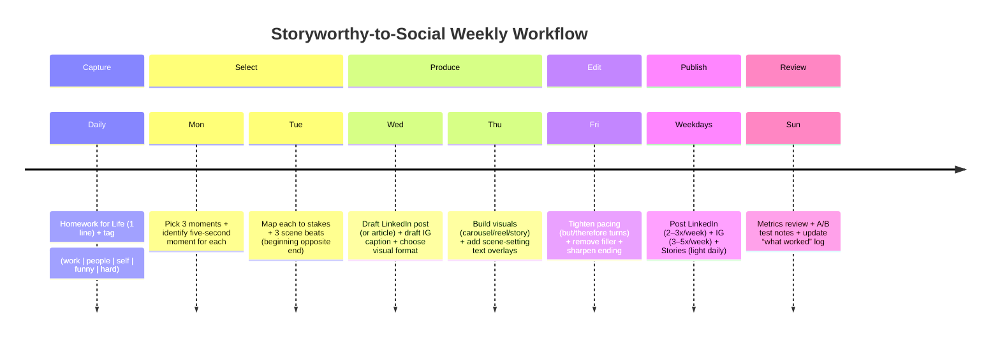

# Adapting Storyworthy Techniques for LinkedIn and Instagram

## Executive summary

*Storyworthy* argues that memorable personal storytelling is not about listing events; it is about bringing one moment of change into clear focus. In Matthew Dicks’s framing, the “reason” a story exists is a brief pivot—what he calls a “five-second moment”—where the storyteller’s view of themselves, another person, or the world shifts. citeturn21view0

Two complementary practices anchor the methodology:

1) **Systematic story capture**: “Homework for Life” (a short daily log of the day’s most storyworthy moment) trains attention and builds an inventory of moments worth shaping into stories. citeturn17view0turn33view0  
2) **Deliberate story editing**: Dicks emphasizes structure (ending-first, beginning-as-opposite), stakes (why the audience cares *now*), scene clarity (“cinema of the mind”), pacing (brevity and forward motion), and endings that land on meaning rather than a throwaway punchline. citeturn27view0turn34search6turn25search7

For **LinkedIn**, the adaptation challenge is: keep the emotional arc while translating the meaning into a professional takeaway without turning the post into a generic “lesson learned” lecture. LinkedIn posts cap at **3,000 characters**, while LinkedIn articles support **up to 125,000 characters**—so your “150–1,300 word” requirement often implies **articles/newsletters** for the upper half of that range. citeturn15search1turn15search27

For **Instagram**, the adaptation challenge is: move the story’s “movie” onto the screen (carousel/reel/story) while front-loading the hook and keeping the caption supportive rather than redundant. Instagram’s publishing APIs and common tooling constraints reflect a **2,200-character caption maximum**, and carousels can be published as up to **10 items** via Meta’s content publishing documentation. citeturn14search7turn35search2turn14search6

**Assumptions (explicit):**
- Your brand voice is unspecified; this report treats you as a **personal brand** creator (not a corporate comms team) and proposes three ready-to-use voices plus templates.  
- Your content goal is a mix of **credibility (LinkedIn)** and **connection/retention (Instagram)**, with soft CTAs (comments, saves, DM prompts) rather than hard selling.
- The “examples” section treats Storyworthy anecdotes as **book-referenced stories** and presents them as **“what I learned from this story”** posts (not as if they happened to you), to avoid misattribution.

## Core methodology and writing style in Storyworthy

### Methodology: what the book is doing, structurally

The Google Books table of contents shows *Storyworthy* organized into three operational stages: **Finding your story**, **Crafting your story**, and **Telling your story**—a workflow that mirrors capture → shape → deliver. citeturn27view0 The chapter titles also reveal a deliberate teaching style: concrete, sometimes blunt, often humorous (“The Weather Sucks So Don’t Talk about It”; “Fine Is Apparently Not a Good Way to Describe My Sex Life”), suggesting the book’s tone is practical and conversational rather than academic. citeturn27view0

### Homework for Life: daily capture as attention training

An excerpt explicitly labeled from *Storyworthy* describes the “Homework for Life” routine: at the end of each day, ask what the day’s most storyworthy moment was, then record **a sentence or two**—kept intentionally small so it can be done daily. citeturn17view0 Dicks describes using a simple two-column spreadsheet (“date” + “story”), arguing simplicity supports habit formation and later retrieval. citeturn17view0

Analytically, this is not just journaling; it is:
- a **forced choice** (pick *one* moment, even on “boring” days),  
- a **compression practice** (capture essence, not full narrative), and  
- a **retrieval scaffold** (short entries that cue full memory later). citeturn17view0turn30search8

### Five-second moments: the core unit of meaning

In a book-excerpted article, Dicks states the “one secret” is that “every great story is about a five-second moment” of transformation or realization. citeturn21view0 He contrasts this with itinerary-style recounting (“let me tell you about my vacation…”), framing that as events without meaning. citeturn21view0

Crucially, he claims the most effective stories are often not the “big” dramatic events, but small moments that are relatable and cognitively graspable—illustrated by examples like realizing he is the last person to hold his daughter in a particular way, or a moment of insight after a stranger picks up his dropped keys. citeturn21view0

### Story structure: ending-first, beginning-as-opposite

The table of contents places “Every Story Takes Only Five Seconds to Tell” (chapter 7) before “Finding Your Beginning” (chapter 8), reflecting a design idea: locate the transformation first, then build backward. citeturn27view0 A commonly reproduced quote attributed to the book describes the beginning as “the opposite of the end,” creating an arc that demonstrates change over time. citeturn24search5turn24search0

This structure has direct implications for social posts:
- Your **hook** can be the “opposite state” (before),  
- the body is the **bridge** (what happened),  
- the end is the **five-second moment** (shift), and  
- the CTA is the **transfer question** (“Where does this show up in your work?”).

### Stakes: attention mechanics, not melodrama

Chapter placement (“Five Ways to Keep Your Story Compelling…” in the contents list) signals stakes as a central craft topic. citeturn27view0 Across multiple summaries of the “stakes” chapter, the tactic set is described as five devices (commonly labeled Elephant, Backpacks, Breadcrumbs, Hourglasses, Crystal Ball). citeturn31search1turn31search0turn31search16

Even if you never use those exact labels on social media, the mechanics translate cleanly:
- Define **what matters** (elephant/problem/peril/mystery) early. citeturn31search16  
- Use **anticipation** (“here’s what I thought would happen…”) and **uncertainty** to keep forward motion. citeturn31search0  
- Slow down right before payoff (hourglass) to heighten attention. citeturn31search16turn31search18

### Scene-setting and sensory detail: “cinema of the mind”

The book’s contents explicitly include “Cinema of the Mind (Also Known as ‘Where the Hell Are You?’)” which signals a priority: the audience must be able to visualize the story as if it were a scene. citeturn27view0 A widely reproduced passage attributed to the book states: “Always provide a physical location for every moment of your story… If the audience knows where you are… the movie is running in their minds.” citeturn34search6

This is the bridge from oral storytelling to social: **specific setting + concrete action** is the minimum viable “scene.” Sensory detail is a scaling tool: you add only as much as supports the five-second moment.

### Pacing: brevity, clarity, and forward motion

The contents include “Brevity Is the Soul of Wit,” as well as “The Principle of But and Therefore,” indicating an emphasis on momentum through causal turns (not “and then… and then…”). citeturn27view0turn33view0 Dicks even praises a child’s made-up story specifically because it flips with “but” and “therefore” rather than monotonous sequencing. citeturn33view0

The “present tense” chapter (“The Present Tense Is King…”) also implies a delivery-based pacing lever. citeturn27view0 A short quote attributed to the book frames present tense as creating immediacy. citeturn26search2

### Endings: meaning, not a neat bow

The table of contents includes “Finding the Frayed Ending…,” implying endings should land with a slightly unresolved, honest edge rather than a forced moral. citeturn27view0 Secondary notes quoting the book emphasize “end on heart” and “close with meaning” as the intent. citeturn25search7turn31search5

For social content, this matters because a post’s end is also its **interaction trigger**: the ending must both resolve the story and open a reader-shaped door.

image_group{"layout":"carousel","aspect_ratio":"1:1","query":["Storyworthy Matthew Dicks book cover","Matthew Dicks storyteller portrait","five second moment story arc diagram","cinema of the mind storytelling setting diagram"],"num_per_query":1}

## Platform translation playbook

### Platform constraints that shape adaptation

**LinkedIn format reality (as of LinkedIn Help):**
- Standard posts: **3,000 characters**. citeturn15search27turn15search1  
- Articles: **up to 125,000 characters**. citeturn15search1  
- Document uploads (often used for “carousel-style” PDFs) are supported in posting flows. citeturn35search4  
- LinkedIn feed ranking relevance considers factors like recency, engagement, whether the post provides knowledge/advice, and the language/constructiveness of conversation. citeturn35search7  

**Instagram format reality (as supported by major tooling docs + Meta documentation):**
- Captions: commonly constrained to **2,200 characters** in many publishing contexts. citeturn14search7turn14search6  
- Carousels: Meta content publishing docs describe publishing up to **10** items in a carousel container. citeturn35search2  
- Reels: Instagram Help says you can record clips that add up to **20 minutes**, with limitations/visibility notes depending on length. citeturn35search34  

### Technique-by-technique adaptation rules

The table below is written as **action rules** (what to do) rather than abstract theory.

| Storyworthy technique | LinkedIn rules (professional long-form) | Instagram rules (caption + visuals) |
|---|---|---|
| Homework for Life | Use a daily log, but publish **1–3 times/week**: “One moment, one shift, one takeaway.” Avoid dumping the whole log; curate. Anchor the takeaway in work, leadership, communication, or craft. citeturn17view0turn35search7 | Use Homework for Life as a **story bank** for carousels/reels: pick moments that can be *seen*. Pair each moment with one visual motif (object/place/screenshot). Keep caption as context + meaning; let visuals carry scene. citeturn17view0turn35search2 |
| Five-second moments | Identify the shift explicitly near the end: “I realized…” / “It clicked…” / “I changed my mind…” (then translate to professional meaning). The hook can begin with the “opposite of the end” to set contrast. citeturn21view0turn24search5 | Put the shift in the **first slide headline** (carousel) or first 1–2 seconds (reel). In captions, the first line should hint at the shift; the mid-caption can provide micro-context. citeturn21view0turn35search2turn35search34 |
| Story structure (ending-first; beginning opposite) | If you write 150–450 words, use a standard post; if you need 600–1,300 words, publish as an article/newsletter (LinkedIn post limit is 3,000 chars). citeturn15search1turn15search27 Start: opposite state. Middle: 3–6 scene beats. End: five-second moment + “so what” for work. | Build carousels as “scene boards”: Slide 1 hook/opposite state; Slides 2–6 beats; Slide 7 shift; Slide 8 takeaway; Slide 9 prompt; Slide 10 CTA. (Up to 10 items supported in Meta carousel publishing docs.) citeturn35search2 |
| Stakes | Make the “elephant” professional: what was at risk—reputation, trust, time, relationship, customer outcome, safety, career momentum. Reveal stakes early so readers have a reason to continue. citeturn31search16turn35search7 | Use stakes as **curiosity + consequence**. Slide 1: “I was about to…” Slide 2: “If this went wrong…” Reels: show the consequence visually. Keep stakes human, not corporate. citeturn31search16turn35search34 |
| Scene-setting + sensory detail (“cinema of the mind”) | Use one “camera line” per scene: place + posture + object (“I’m standing in… holding… hearing…”). Don’t over-describe; pick details that point toward the five-second moment. citeturn34search6turn27view0 | Let visuals do most of the scene-setting. Captions should add only what the image cannot show: the one sensory detail or internal thought that creates meaning. citeturn35search2turn34search6 |
| Pacing | Write in short paragraphs, cut connective “and then” sequences, and favor causal turns (“but/therefore”) to create momentum. The “but & therefore” logic is explicitly praised as superior to “and then” storytelling. citeturn33view0turn27view0 | Carousels: one idea per slide; keep text large and minimal. Reels: cut pauses, keep beats tight, and place the five-second moment near the end (then add a 1–2 second “meaning” line). citeturn35search34turn35search2 |
| Endings (“heart” / frayed ending) | End with meaning + reader invitation. Avoid a forced moral; instead, show a human truth and ask a grounded question. The book’s framing emphasizes stories ending with meaning (“heart”) rather than a neat joke. citeturn25search7turn27view0 | End the caption with a prompt that fits Instagram behavior: “Save this if…” / “DM me ‘X’ if…” / “Which part hit you?” Keep hashtags minimal and relevant. (Caption limit considerations apply.) citeturn14search7turn35search27 |

image_group{"layout":"carousel","aspect_ratio":"16:9","query":["LinkedIn document post carousel example PDF","Instagram carousel storytelling template slides","Instagram Reels storyboard template","LinkedIn long form storytelling post example"],"num_per_query":1}

## Brand voice options and templates

### Brand voice option set

If your voice is not yet defined, the fastest way to define it without being fake is to choose:
- **Default sentence length** (short vs medium),
- **Emotion bandwidth** (restrained vs open),
- **Humor level** (none vs light vs frequent),
- **Vocabulary** (plainspoken vs formal),
- **Formatting** (dense paragraphs vs line breaks),
- **CTA style** (question vs directive vs invitation).

This report provides three voice presets that cover most professional creator use-cases:

**Professional (credible, calm):**
- Fewer adjectives, more precise nouns/verbs.
- Reflection is framed as “what I noticed / what I changed.”  
- Minimal emoji; no slang.  
- Best for: IT/craft lessons, leadership, process, decision-making.

**Friendly/relatable (warm, human):**
- More “you/we,” more acknowledgment of uncertainty.
- Light humor is allowed, but not at the ending.
- Best for: community-building, mentoring tone, growth narratives.

**Witty/concise (sharp, compact):**
- Short sentences. Controlled punchlines early.
- One unexpected line (max) per post; meaning still lands cleanly.
- Best for: high frequency posting, small daily moments, quick lessons.

### Post templates (12 total)

**Length targets (practical mapping):**
- LinkedIn standard post (3,000 characters max): ~150–450 words for readability and headroom. citeturn15search27  
- LinkedIn article/newsletter: 600–1,300 words fits your stated range while staying inside article limits. citeturn15search1  
- Instagram caption: 125–2,200 characters. citeturn14search7turn14search6  

#### LinkedIn templates (6)

**Template LI-1: The five-second shift (standard post, ~200–350 words)**  
```text
Hook (opposite of the end):
I used to believe [OLD BELIEF / DEFAULT BEHAVIOR].

Scene 1 (where/when):
[PLACE]. [TIME]. I’m [ACTION] and thinking [THOUGHT].

Stakes (why it mattered):
If [RISK], then [CONSEQUENCE].

Turn (but/therefore):
But [TURNING EVENT].
Therefore [NEXT ACTION / REALIZATION].

Five-second moment:
And then I realized: [SHIFT IN ONE SENTENCE].

Meaning (professional translation):
In work, this shows up as [PRINCIPLE].
What I do differently now: [BEHAVIOR CHANGE].

CTA:
Have you had a moment where [QUESTION ABOUT READER’S VERSION]?
```

**Template LI-2: The “small moment inside a big topic” (standard post, ~250–400 words)**  
```text
Claim (not a lecture—set a scene):
Most people talk about [BIG TOPIC] like it’s abstract.
I learned it in a moment that lasted maybe [SECONDS].

Mini-story (3 beats):
1) [SCENE SETTING]
2) [TENSION / STAKES]
3) [FIVE-SECOND MOMENT]

Takeaway:
If you’re working on [BIG TOPIC], try [ONE PRACTICE].

CTA:
If you want, comment “[KEYWORD]” and I’ll share [RESOURCE / CHECKLIST].
```

**Template LI-3: The “mistake → repair → principle” (standard post, ~200–350 words)**  
```text
Hook:
I got [COMMON THING] wrong in a way that cost me [COST].

Scene:
[PLACE/TIME]. I [ACTION]. I was sure [ASSUMPTION].

But:
But [CONTRADICTION].

Therefore:
Therefore I [REPAIR ACTION].

Five-second moment:
The moment I understood what I’d missed: [SHIFT].

Rule:
Now I use this rule: [RULE IN ONE LINE].

CTA:
What’s one small rule that’s improved your work lately?
```

**Template LI-4: The “before/after operating system” (standard post, ~250–450 words)**  
```text
Before:
My default was [DEFAULT].

Trigger scene:
[WHERE]. [WHEN]. [WHAT HAPPENED].

Five-second moment:
[SHIFT].

After:
Now my default is [NEW DEFAULT].

3 practical steps:
- [STEP 1]
- [STEP 2]
- [STEP 3]

CTA:
If you’re trying to change [AREA], what’s your hardest part?
```

**Template LI-5: The “book story → application” (standard post, ~200–350 words)**  
```text
Context:
A story from [BOOK/CREATOR] has been stuck in my head.

Story summary (no spoilers beyond what’s needed):
[3–5 sentences, scene-based].

Five-second moment:
[SHIFT].

Application:
In [YOUR DOMAIN], this maps to [PRINCIPLE].
This week I’m trying: [EXPERIMENT].

CTA:
If you’ve read it, what did you take from it?
If not, what’s your version of this situation?
```

**Template LI-6: Article version (LinkedIn article, ~800–1,200 words)**  
```text
Title: [RESULT] from a [SMALL MOMENT]
Subtitle: What I learned from a five-second shift

Section A: The scene (200–300 words)
Section B: What was at stake (150–200 words)
Section C: The five-second moment (100–150 words)
Section D: The principle (150–250 words)
Section E: How to apply this at work (3–5 steps)
Closing: A “frayed” ending question + invitation to reply
```

#### Instagram templates (6)

**Template IG-1: Carousel storyboard (caption 800–1,400 characters; 8–10 slides)**  
```text
Slide 1 (hook): “I used to [OLD DEFAULT].”
Slide 2 (scene): “Then this happened: [SCENE].”
Slide 3 (stakes): “If [RISK], then [CONSEQUENCE].”
Slide 4 (but): “But [TURN].”
Slide 5 (therefore): “So I [ACTION].”
Slide 6 (five-second moment): “And then I realized: [SHIFT].”
Slide 7 (meaning): “This changed how I [BEHAVIOR].”
Slide 8 (rule): “New rule: [RULE].”
Slide 9 (prompt): “Where do you see this in your life?”
Slide 10 (CTA): “Save/share/DM: [CTA].”

Caption:
1–2 lines of context + the meaning + one question.
Hashtags: 3–8 relevant tags (test; keep tight). citeturn14search6turn35search27
```

**Template IG-2: Single image “scene + insight” (caption 500–1,100 characters)**  
```text
Line 1 (hook): [SURPRISING LINE / CONTRAST]
Line 2–5 (scene): [WHERE + WHAT + ONE SENSORY DETAIL]
Line 6–8 (five-second moment): [SHIFT]
Line 9–12 (meaning): [ONE PRACTICAL TAKEAWAY]
CTA: [QUESTION OR “SAVE IF…”]
```

**Template IG-3: Reel script (15–45 seconds; caption 300–900 characters)**  
```text
0–2s: On-screen hook: “[OLD DEFAULT].”
2–10s: Scene: show [OBJECT/PLACE] + voiceover context
10–20s: Stakes: “If [RISK]…”
20–30s: Five-second moment: “Then I realized…”
30–45s: Meaning: “Now I do [NEW BEHAVIOR].”
Caption: 1–2 sentences + CTA (comment/save/DM)
```

**Template IG-4: Story sequence (3–7 frames; each frame 1 idea)**  
```text
Frame 1: Hook question
Frame 2: Scene photo/video
Frame 3: What was at stake
Frame 4: The turn
Frame 5: The realization
Frame 6: The rule
Frame 7: Poll / slider / question sticker
```

**Template IG-5: “Two truths and a shift” (caption 700–1,200 characters)**  
```text
Truth #1: [OBSERVATION]
Truth #2: [OBSERVATION]
Shift: “But then I noticed [FIVE-SECOND MOMENT].”
Now: [NEW RULE]
CTA: “Which part fits you?”
```

**Template IG-6: “Micro-story, micro-lesson” (caption 250–600 characters)**  
```text
[SCENE IN ONE LINE].
[TURN IN ONE LINE].
[SHIFT IN ONE LINE].
New rule: [RULE].
```

## Worked examples

### Source anecdotes used

The three anecdotes below are drawn from the book-excerpted list of “small” moments Dicks cites as strong stories (e.g., the “last person to hold” moment, the “hungry as a boy” revelation, the “dropped keys” insight). citeturn21view0

**Attribution note:** The samples are written as “lesson from a story in *Storyworthy*,” not as personal claims.

### Anecdote one: “The last person who will hold my daughter like a little girl”

#### LinkedIn examples

**Professional voice (standard post, ~250–350 words)**  
A story from *Storyworthy* has been stuck in my head.

Dicks describes picking up his eight-year-old daughter and realizing something quietly final: he may be the last person who will ever hold her in that exact “little kid” way.

Nothing dramatic happens. No plot twist. No big event.

The stakes are emotional and invisible: time moves forward, and you don’t get a notification when you’ve done something for the last time.

What makes it work (as a story) is the five-second moment: a shift from “this is normal” to “this is ending.”

The professional version of that moment shows up when:
- you ship a workflow that was painful to build, and people stop noticing it because it finally works  
- you answer the same “basic” question for the last time because your team learned  
- you close a recurring incident pattern and don’t realize it’s gone until weeks later

The practical takeaway I’m keeping from this story:

If you want meaning (and better stories), you have to notice the small endings while they’re still happening.

One action you can try this week: write down one “last time I didn’t realize was a last time” moment. Not for nostalgia. For attention.

What’s a small “ending” you only recognized after it passed?

**Friendly/relatable voice (standard post, ~250–350 words)**  
I’m reading *Storyworthy* and I keep thinking about one small moment.

Dicks talks about picking up his daughter and realizing he’s probably the last person who will ever hold her like that—like a little kid.

That hit me because it’s not a “big story.” It’s the opposite. It’s a normal day that becomes different in five seconds.

The shift is the whole point:
- before: “I’m just picking my kid up.”  
- after: “This version of today is not repeatable.”

What I like about it (outside of storytelling) is what it implies:

A lot of our lives are made of moments we assume are repeatable. Then one day they’re gone, and we act surprised.

In work, I see the same thing with trust and relationships. We assume we’ll “always” have time to clarify, coach, apologize, or say thanks.

Then a reorg happens. A teammate leaves. The project ends. The window closes.

So my tiny habit this week is simple: I’m writing down one moment a day that felt ordinary but wasn’t.

Not a diary. One line.

What’s a moment from the past month you wish you’d noticed more while it was happening?

**Witty/concise voice (standard post, ~180–260 words)**  
A *Storyworthy* moment I can’t shake:

He picks up his daughter.  
And realizes: “I might be the last person who will ever hold her like this.”

No drama. Just a five-second shift.

That’s the whole point: the story isn’t the event. It’s the change.

Work version:
- “I’ll give feedback later.”  
- “I’ll say thanks later.”  
- “I’ll check in later.”

Later is not guaranteed. Calendars look infinite until they don’t.

My takeaway:
Pick one small moment today that felt ordinary. Write one sentence about why it mattered.

Question: what’s your “I didn’t know it was the last time” moment?

#### Instagram examples (caption + visual pairing)

**Professional voice (caption ~1,000–1,400 characters)**  
Caption:  
A story from *Storyworthy* that keeps replaying:

A dad picks up his daughter—something he’s done a hundred times—and realizes he may be the last person who will ever hold her like a little kid.

That’s the five-second moment:  
ordinary → irreversible

It’s a useful reminder for work, too. The most meaningful shifts often happen quietly:
- the last time an incident pattern repeats  
- the last time a teammate needs the same help  
- the last time you *don’t* say the thing you meant to say

I’m trying a small practice: one line per day—“what made today different?”

Not for productivity. For attention.

If you want, comment “NOTE” and I’ll share a simple daily capture template.

Visual pairing:  
Carousel (8 slides):  
1) “The last time isn’t labeled.”  
2) “A Storyworthy moment…”  
3) Scene (illustration/photo of hands holding a kid’s backpack)  
4) The realization  
5) Why it matters  
6) Work translation  
7) The one-line habit  
8) Prompt: “What would you write today?”

Hashtags: keep tight (3–8). citeturn14search6turn35search27

**Friendly/relatable voice (caption ~900–1,300 characters)**  
Caption:  
I read a story in *Storyworthy* where a dad picks up his daughter and suddenly realizes he might be the last person who will ever hold her like that.

It’s such a small moment. That’s why it works.

It made me think about how many “regular” moments are only regular until they’re gone.

Work has versions of this too:
- the last time you work with a certain person  
- the last time you get to fix something before it becomes a bigger mess  
- the last time you can say “thanks” while it still feels current

Tiny habit I’m stealing: one sentence at night—what made today different?

What’s a moment you wish you’d noticed more while it was happening?

Visual pairing:  
Single image: a quiet “in-between” moment (empty hallway, coffee mug, train seat, etc.).  
Alt text idea: “A quiet scene to match a quiet realization.”

**Witty/concise voice (caption ~450–700 characters)**  
Caption:  
A *Storyworthy* gut-punch in one sentence:

He picked up his daughter and realized it might be the last time she’ll be held like a little kid.

That’s the story.  
Ordinary → not repeatable.

Takeaway: write down one small moment today that won’t happen forever.

Your turn: what’s a “last time” you didn’t recognize until later?

Visual pairing:  
Carousel (5 slides): last-time prompt + 3 examples + question sticker prompt screenshot.

---

### Anecdote two: “My wife knew I was hungry as a boy”

#### LinkedIn examples

**Professional voice (standard post, ~250–380 words)**  
One of the most effective Storyworthy examples is also one of the simplest.

Dicks describes a moment where his wife reveals she knows he was hungry as a boy—despite him never explicitly telling her. It’s not plot. It’s insight.

The stakes are relational: being known changes how you understand a relationship and yourself.

Why it translates to professional communication:

In a lot of workplaces, people do not say the thing.  
They “manage” it. They work around it. They keep it private.

And yet good teammates often know anyway:
- they see the pattern  
- they notice the avoidance  
- they read the micro-behaviors you think are invisible

The five-second moment is that shift:
“I’m hiding this” → “I’ve been visible the whole time.”

If you want to adapt this into LinkedIn content without over-sharing, the move is:
- keep the scene specific,  
- keep the emotion honest,  
- translate the meaning into a professional principle (trust, feedback, psychological safety, mentoring).

A small rule I use because of this kind of story:
If something matters, say it plainly at low volume (early), instead of leaking it in complicated ways later.

What’s an example of “people already knew” in your work life?

**Friendly/relatable voice (standard post, ~250–380 words)**  
A *Storyworthy* moment that feels uncomfortably real:

His wife says she knows he was hungry as a kid. He hadn’t told her.

The story isn’t “my childhood was hard.”  
The story is: you can be known more than you think.

I’ve watched people carry things at work the same way:
- “I’m fine.”  
- “It’s nothing.”  
- “No worries.”

And everyone can tell it’s not nothing.

The surprising part (for me) is how often we think we’re protecting ourselves by not saying the thing… but we’re actually just making it harder for people to support us.

So the practical takeaway I pulled from that story is simple:
You don’t have to disclose everything. But you can stop pretending you’re invisible.

If you’re leading a team, that’s a reminder to ask better questions.  
If you’re on a team, it’s permission to use clearer words.

What’s a time someone understood something about you before you said it out loud?

**Witty/concise voice (standard post, ~180–260 words)**  
A Storyworthy moment:

His wife said she knew he was hungry as a kid.  
He never told her.

There’s your five-second shift:
“I’m hiding this” → “I’m already seen.”

Work version:
You can’t “I’m fine” your way through everything. People notice. They just don’t always know how to respond.

Clean takeaway:
Say the thing early, in plain language. Low drama. High clarity.

Question: what’s something you tried to hide at work that everyone clocked anyway?

#### Instagram examples (caption + visual pairing)

**Professional voice (caption ~900–1,400 characters)**  
Caption:  
A moment from *Storyworthy* that I keep returning to:

A wife tells her husband she knows he was hungry as a boy—even though he never told her.

The story isn’t the backstory.  
It’s the five-second shift: being known changes what’s possible next.

In professional settings, we often assume:
- no one notices, or  
- noticing is the same as judging.

But strong teams notice patterns because they pay attention.

A practical application:
If you want trust, trade “vague coping” for “small clarity.”

Examples of “small clarity”:
- “I’m overloaded this week; I can do X but not Y.”  
- “I’m anxious about this launch; can we confirm the rollback plan?”  
- “I don’t understand yet; can you walk me through the decision?”

What’s one sentence you wish you’d said earlier in a situation like this?

Visual pairing:  
Carousel (8–10 slides):  
1) “People notice more than you think.”  
2) The Storyworthy moment (1–2 lines)  
3) Why it matters  
4) Work translation  
5) 3 “small clarity” scripts  
6) What changes after you say it  
7) Prompt  
8) Save/share CTA

**Friendly/relatable voice (caption ~850–1,200 characters)**  
Caption:  
From *Storyworthy*: his wife told him she knew he was hungry as a kid, even though he never said it.

That made me pause because it’s such a human thing to do:
carry something quietly and hope it stays private.

But a lot of the time, people who care about you already sense it.

So my takeaway isn’t “tell everyone everything.”  
It’s: stop acting like nothing is happening.

Even one honest sentence can change the whole relationship.

If this hits, what’s the “one sentence” you’d want to say—at work or at home?

Visual pairing:  
Single photo: a close-up of a notebook page with one line written, or a muted “kitchen table” scene.

**Witty/concise voice (caption ~400–650 characters)**  
Caption:  
A *Storyworthy* moment in plain terms:

He didn’t say he was hungry as a kid.  
His wife already knew.

Shift: private → visible.

Takeaway: clarity beats hiding.

If you had to say one sentence this week that you’ve been avoiding… what is it?

Visual pairing:  
Carousel (5 slides): “One sentence you’re avoiding” + 3 examples + question.

---

### Anecdote three: “I dropped my keys; a stranger picked them up; I saw myself differently”

#### LinkedIn examples

**Professional voice (standard post, ~250–380 words)**  
A story from *Storyworthy* that translates directly to leadership and customer work:

Dicks describes dropping his keys, and a stranger picks them up before he can. In that instant, he has an insight about himself—he describes it as realizing he’d been selfish (in that day, and more broadly).

What matters is not the keys. It’s the reversal:
“I’m just moving through my day” → “I’m not showing up like I think I am.”

This kind of five-second moment is useful for professional reflection because it is:
- triggered by a small external action (someone else’s kindness),  
- instantly diagnostic (it reveals a gap), and  
- behaviorally actionable (you can do something different tomorrow).

How to adapt this to LinkedIn without becoming preachy:
- set the scene in one line  
- state the insight plainly  
- offer one concrete behavior change  
- ask a question that invites others to share moments of recalibration

One behavior change I like as a follow-through:
Pick one default interaction today and make it slightly more generous (time, patience, clarity, credit).

What’s a small moment that made you see yourself differently?

**Friendly/relatable voice (standard post, ~250–380 words)**  
One of Dicks’s examples in *Storyworthy* is painfully small (and that’s why it works):

He drops his keys. A stranger picks them up. And he suddenly sees himself—how he’d been acting all day—in a harsher light than he expected.

The moment isn’t “a nice stranger helped.”  
The moment is: kindness became a mirror.

I like stories like this because they don’t demand a life overhaul. They suggest a reset.

In work, my version is usually:
- someone asking a simple question I should’ve anticipated  
- a teammate doing something considerate I forgot to do  
- a customer being patient when I didn’t fully deserve it

Those moments aren’t “content.”  
They’re feedback.

If you had a small moment recently that felt like a mirror, what was it?

**Witty/concise voice (standard post, ~180–260 words)**  
Storyworthy moment:

He drops his keys.  
A stranger picks them up.  
He realizes: “I’ve been acting like a selfish jerk.”

That’s the whole story.  
Small action. Big self-audit.

Work translation:
Sometimes the best feedback isn’t formal. It’s a tiny moment that exposes your default mode.

My takeaway:
Treat small mirrors like real signals. Adjust fast.

Question: what’s a “small mirror” moment you’ve had recently?

#### Instagram examples (caption + visual pairing)

**Professional voice (caption ~900–1,300 characters)**  
Caption:  
A *Storyworthy* moment that feels like leadership training in disguise:

He drops his keys. A stranger picks them up.  
And he has a five-second realization about himself—how he’d been showing up that day.

That’s what makes it strong: the story isn’t “someone helped.”  
The story is “I saw myself.”

In work, this happens in tiny ways:
- a teammate compensates for your oversight  
- a customer stays calm when you’re scrambling  
- someone says “all good” and you realize it wasn’t all good

Small moments can be mirrors. If you notice them, you can change quickly—without waiting for a bigger failure.

Prompt: what’s one tiny moment that made you recalibrate how you show up?

Visual pairing:  
Carousel (8 slides):  
1) “Small moments are mirrors.”  
2) Scene: keys/shoe/hallway  
3) The stranger’s action  
4) The realization  
5) Why this matters at work  
6) 3 examples of “mirror moments”  
7) One small behavior change  
8) Question + save CTA

**Friendly/relatable voice (caption ~800–1,200 characters)**  
Caption:  
From *Storyworthy*: he drops his keys, a stranger picks them up, and it hits him—he hasn’t been the person he thinks he is (at least not that day).

I love/hate stories like this because they’re so normal.

No big drama. Just a small kindness that makes you look at yourself honestly.

If you’ve been feeling stuck, this is a softer way to change:
Don’t wait for a crisis. Pay attention to the tiny mirrors.

Question for you: what’s a moment that made you go, “Oh. I need to adjust”?

Visual pairing:  
Single photo: keys on a shoe / sidewalk / train platform. Keep it simple.

**Witty/concise voice (caption ~350–600 characters)**  
Caption:  
He dropped his keys.  
A stranger picked them up.  
He realized he’d been acting like a jerk.

That’s a five-second moment:
kindness → mirror.

Takeaway: take the hint. Adjust.

What’s your “tiny mirror” moment lately?

Visual pairing:  
5-slide carousel with each sentence as a slide + question.

## Publishing workflow and measurement

### Content workflow timeline



### Practical checklist

**Hooks (first lines that earn “continue”):**
- Start with the **opposite state**: “I used to think…” citeturn24search5turn27view0  
- Start with the **stakes**: “If this went wrong, …” citeturn31search16  
- Start with the **scene** (one camera line): “I’m standing…” citeturn34search6  

**Editing for Storyworthy pacing:**
- Delete “and then” chains; replace with “but/therefore” logic (or implied causality). citeturn33view0turn27view0  
- Keep only scene details that support the five-second moment (one object, one place, one sensory detail). citeturn34search6  
- Put the five-second moment **near the end**, then add meaning in one clean paragraph (LinkedIn) or one clean line (IG). citeturn21view0turn27view0  

**CTAs that fit the platform:**
- LinkedIn: ask for a story-shaped comment (“When have you seen this?”) and keep tone constructive (LinkedIn relevance factors include language/constructiveness). citeturn35search7  
- Instagram: “Save if…” and “DM me ‘X’ if…” (saves/shares are strong intent signals in many creator strategies; treat as testable).  

**Hashtags:**
- LinkedIn: start with **3–5 relevant hashtags** and iterate. citeturn35search27  
- Instagram: stay within known limits (commonly described as up to 30 hashtags in IG publishing contexts) and keep relevance high. citeturn14search6turn14search7  

**Image and format suggestions:**
- LinkedIn: pair story posts with a simple visual that supports the scene (photo of object/place), or a document post (“carousel”) for structured beats. Document upload is part of posting flows. citeturn35search4  
- Instagram: for story posts, default to carousel or reels; Meta documentation describes carousel publishing up to 10 items. citeturn35search2turn35search34  

### A/B test ideas (structured, not random)

Run A/B tests as **one-variable changes** over 2–4 weeks:

- **Hook type**: opposite-state vs stakes-first vs scene-first. citeturn24search5turn31search16turn34search6  
- **Format**: LinkedIn standard post vs article; IG carousel vs reel. citeturn15search1turn35search2turn35search34  
- **Ending**: meaning statement vs meaning + question vs meaning + “save” CTA. citeturn25search7turn27view0  
- **Scene density**: 1 scene beat vs 3 beats vs 5 beats (track drop-off and saves).  

### Metrics to track and dashboard layout

A measurement system should separate:
- **Distribution** (reach/impressions),
- **Engagement quality** (comments, shares, saves),
- **Conversion proxies** (profile views, link clicks, DMs),
- **Content craft diagnostics** (hook performance, completion).

LinkedIn explicitly describes ranking relevance signals like recency, engagement, topic/value, and language/constructiveness, which supports tracking both distribution and conversation quality. citeturn35search7

**Suggested analytics dashboard layout (sample)**

| Section | KPI | Definition / formula | Why it matters | Targeting notes |
|---|---|---|---|---|
| Output | Posts published | count/week | Consistency baseline | Segment by platform + format |
| Reach | Impressions | platform native | Distribution | Track by hook type |
| Reach | Reach (unique) | platform native | Audience expansion | Especially IG |
| Engagement | Engagement rate | (likes+comments+shares+saves) / impressions | Content resonance | Compare within same format |
| Depth | Saves (IG) / “Dwell” proxies (LI) | saves; LI: comments length or meaningful replies | Indicates usefulness | Tag posts as “how-to” vs “story” |
| Conversation | Comments per 1k impressions | comments / impressions * 1000 | Audience response | Watch constructiveness (LI) citeturn35search7 |
| Sharing | Shares / reposts | platform native | Network expansion | Strong for stories with clear meaning |
| Conversion proxy | Profile visits | platform native | Interest in you | Correlates with strong endings |
| Conversion proxy | Link clicks | platform native | Intent | Track by CTA placement |
| Retention | Follower growth | net new/week | Compounding result | Lagging indicator |
| Craft diagnostic | Hook-to-continue rate | LI: “see more” clicks (if available) / IG: carousel swipe-through | Hook effectiveness | Track by hook type |

**Sample KPI starting points (assumption-based; adjust to your baseline):**
- LinkedIn: improve comments per 1k impressions by 10–20% over 4 weeks by tightening stakes + ending question.
- Instagram: improve saves/share rate by 10–20% over 4 weeks by using carousel storyboards and clearer “rule” slides.

### Caption + image pairing library

Use pairings that preserve “cinema of the mind” while staying platform-native: citeturn34search6

- **Object-as-scene**: keys, notebook, ticket, badge, keyboard, coffee mug. (Best for “small moment” stories.)  
- **Place-as-scene**: hallway, train platform, desk at night, empty meeting room, server rack aisle.  
- **Text-on-slide**: one sentence per slide for “but/therefore” momentum; up to 10 carousel items referenced in Meta publishing docs. citeturn35search2  
- **Reel as reenactment**: show hands/objects; voiceover the scene; land the five-second moment at the end; reels can be recorded up to 20 minutes, but most storytelling performs better when tight—treat length as a choice, not a requirement. citeturn35search34